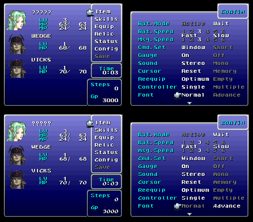
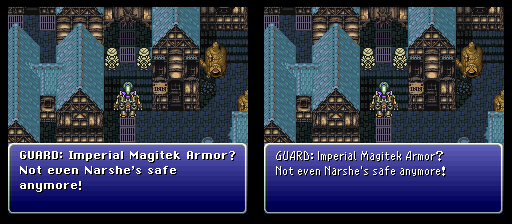

# FF6 multi-fonts romhack 1.4.1

## Introduction
This romhack made in 2017 implement a selectable Final Fantasy 6 Advance (GBA) font in the game config menu. both the fixed-width font and the variable-width font are affected by the menu option change. There are two implementations; the original hack and the one made for an expanded ROM (`_EXP` asm files).

## Screenshots

The main menu and config menu with the original font on top and on bottom the GBA font. The menu option to toggle the font is on the bottom of the config menu:

The variable-with font used for dialogues and descriptions is also affected by the option. Original font on the left and GBA one on the right:

## New text-centering control code

A new dialogue control code have been added since centering can be different with two possible fonts. Writing `$17` at the beginning of a line now center automatically the line given it ends by new line (`$01`), end parameter (`$11`, `$12`) or end page (`$13`). In FF3usME, use `<OP$17>` as shown here:

## ROM to use

You need a FF3us 1.0 ROM. As an example `Final Fantasy III (USA) 1.0.sfc` in the no-intro romset is one. The ROM SHA-1 is `4F37E4274AC3B2EA1BEDB08AA149D8FC5BB676E7`. This hash is from a ROM with no SNES header, if your ROM have one there are tools to remove it.

## Technicalities

The romhack can be applied by assembling `main.asm` or `main_EXP.asm` with [xkas 0.06](https://www.romhacking.net/utilities/269/). If you use the header option in the ASM files you must enable it in all files. The only free space the romhack use is less than `$D0` bytes at end of bank `$C3` for actual menu work. Otherwise, functions have been optimized or at least shortened in order to fit in the new code, especially in bank `$C0`. There are other code changes but they are smaller and always within the function they originally are from. See the asm files for all details.

In the original romhack, both fonts fits where the original font was, using the free space before and after in bank $C4. The free space used before the fixed-width font to draw black menu backgrounds has been simulated by loading blank tiles in VRAM. This mean this version of the patch does not work with icon expansions or other hacks adding characters in the fxed-width font before index `0x80`. Since original font is moved, this patch break FF3usME dialogue viewing but not dialogue editing. You can always open a second editor instance to find caption, see changes, etc.

In the expanded hack (`_EXP` asm files), Normal font is keep where it is in original ROM while GBA font is moved to `$F20800`. Note that the `$F20000-$F207FF` range is reserved and filled with 00 to copy like in bank `$C4` the empty space before the Normal fixed-width font. With this version of the hack, you can see dialogues edits made in FF3usME and you can expand fixed-width font characters before index `0x80`.
